# Kasparro – Multi-Agent Content Generation System

This project implements the Applied AI Engineer Challenge by Kasparro, where the objective is to design a modular multi-agent automation system that transforms a small product dataset into structured, machine-readable content pages.

The system uses multiple specialized agents, reusable logic blocks, custom JSON templates, and a top-level orchestrator to automatically generate:

- `faq.json`
- `product_page.json`
- `comparison_page.json`

Everything is created autonomously through agent workflows — not manual prompts and not a single-script wrapper.

## 🚀 Project Overview

This system demonstrates:

- Multi-agent workflow design
- Clear agent boundaries
- Reusable content logic blocks
- A custom template engine
- Deterministic generation using only the given product data
- Fully structured JSON output

The pipeline runs end-to-end via `run.py` and produces all output files in the `output/` directory.

## 🧠 System Architecture

### Agents Implemented

#### 1. Parser Agent

- Reads `product.json`
- Cleans & normalizes fields
- Converts the raw product input into a consistent internal model

#### 2. Question Generator Agent

- Generates 15+ user questions
- Categorizes questions into:
  - Informational
  - Usage
  - Safety
  - Ingredients
  - Purchase
  - Comparison

#### 3. Template Agent

- Loads JSON templates
- Applies logic blocks
- Injects generated content dynamically
- Produces structured JSON pages

#### 4. Comparison Agent

- Creates a fictional Product B (as required)
- Compares:
  - Ingredients
  - Benefits
  - Usage
  - Price
- Generates a structured comparison object

#### 5. Orchestrator Agent

- Controls the entire workflow:
  - Parse input
  - Generate questions
  - Render FAQ page
  - Render product page
  - Build comparison
  - Render comparison page
  - Save all JSON outputs

## 🧩 Reusable Content Logic Blocks

Inside `content_blocks.py`, reusable functions are defined for:

- Extracting benefits
- Formatting usage instructions
- Summarizing side effects
- Generating comparison fields
- Building standardized content chunks

These blocks ensure extensibility and avoid duplicated logic across templates.

## 📝 Template Engine

The system uses custom JSON templates, located in:

```
templates/
```

Each template defines:

- Field structure
- Placeholders
- Rules for injecting logic blocks

The template engine processes all templates and produces finalized JSON pages.

## 📄 Generated Output

Running the pipeline produces:

```
output/
  faq.json
  product_page.json
  comparison_page.json
```

Each file is clean, structured, and machine-readable — as required.

## 🧪 Tech Stack Used

- Python 3.10+
- Custom multi-agent system (Python classes)
- JSON (templates, data, outputs)
- Python Standard Library (`os`, `json`, `typing`)
- VS Code / Cursor AI (IDE only)

No external APIs, LLM prompts, or UI components are used, per challenge guidelines.

## ▶️ How to Run

From the project root:

```powershell
python -m src.run
```

All output files will be generated under the `output/` folder.

## 📂 Repository Structure

```
src/
  __init__.py
  run.py
  content_blocks.py
  agents/
    __init__.py
    parser_agent.py
    question_generator_agent.py
    template_engine_agent.py
    compare_agent.py
    orchestrator.py

templates/
  faq_template.json
  product_template.json
  comparison_template.json

input/
  product.json

output/
  (generated files)

docs/
  projectdocumentation.md

README.md
```

## 📚 Documentation

Full explanation of:

- Problem statement
- Solution approach
- Assumptions
- System design
- Workflow diagrams

is available in:

```
docs/projectdocumentation.md
```

## ✔️ Notes

- No UI was required or used
- No external data sources were added
- All content is generated from the single provided product JSON
- The system is modular and easily extendable to more products or templates

## System Architecture Diagram


## End-to-End Workflow / Flowchart Diagram

```mermaid
flowchart TD
    START([START])
    LOAD["Load product.json"]
    PARSE["Parser Agent"]
    MODEL["Generate Clean Product Model"]
    QGEN["Question Generator Agent"]
    QUESTIONS["Generate 15+ categorized questions"]
    FAQTPL["Template Agent → FAQ Template"]
    FAQOUT["Create faq.json"]
    COMP["Comparison Agent"]
    COMPDATA["Generate Product B + Comparison Data"]
    PRODTPL["Template Agent → Product Template"]
    PRODOUT["Create product_page.json"]
    COMPTPL["Template Agent → Comparison Template"]
    COMPOUT["Create comparison_page.json"]
    END([END])
    
    START --> LOAD
    LOAD --> PARSE
    PARSE --> MODEL
    MODEL --> QGEN
    QGEN --> QUESTIONS
    QUESTIONS --> FAQTPL
    FAQTPL --> FAQOUT
    FAQOUT --> COMP
    COMP --> COMPDATA
    COMPDATA --> PRODTPL
    PRODTPL --> PRODOUT
    PRODOUT --> COMPTPL
    COMPTPL --> COMPOUT
    COMPOUT --> END
```


